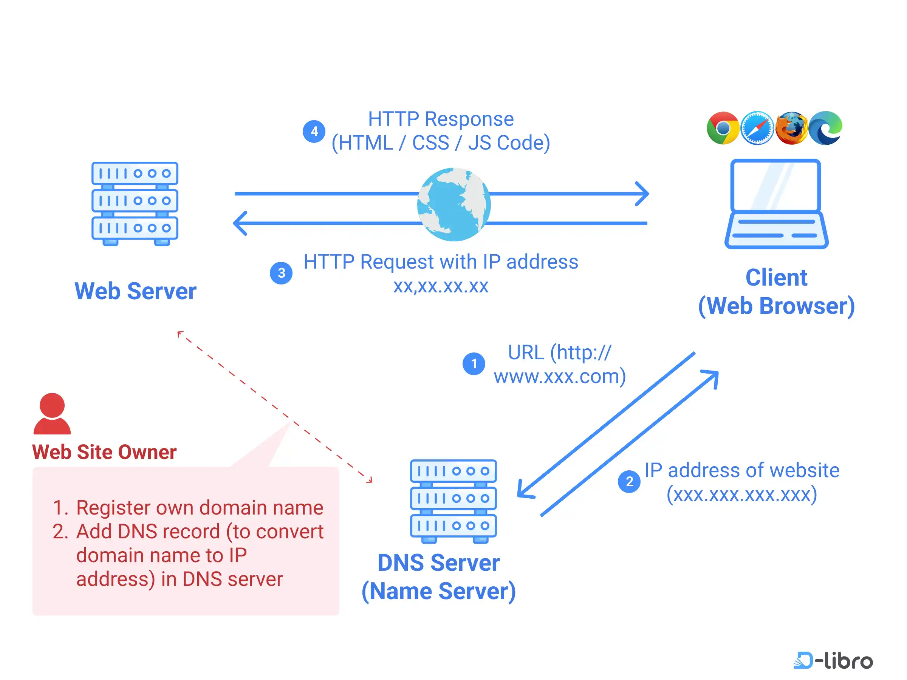
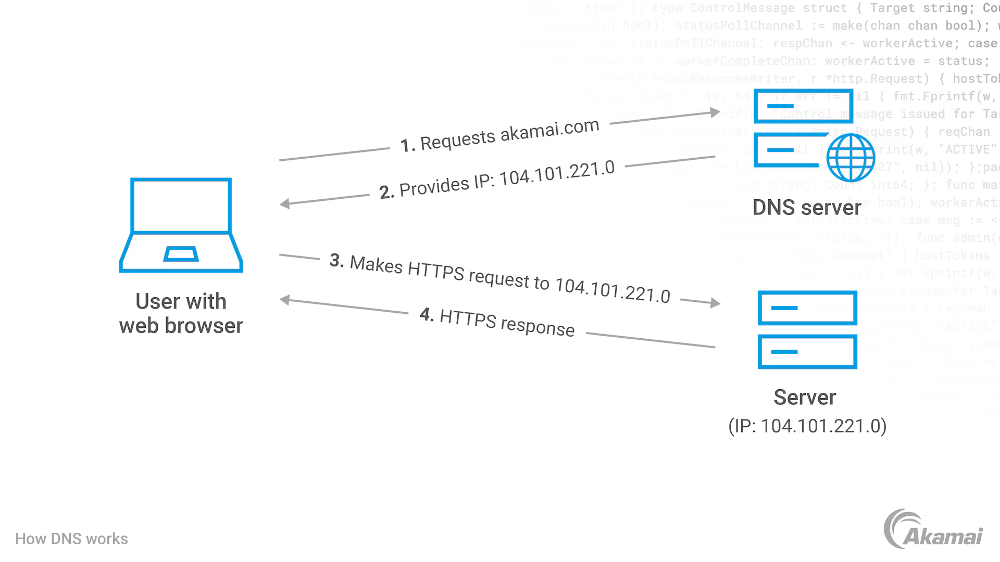
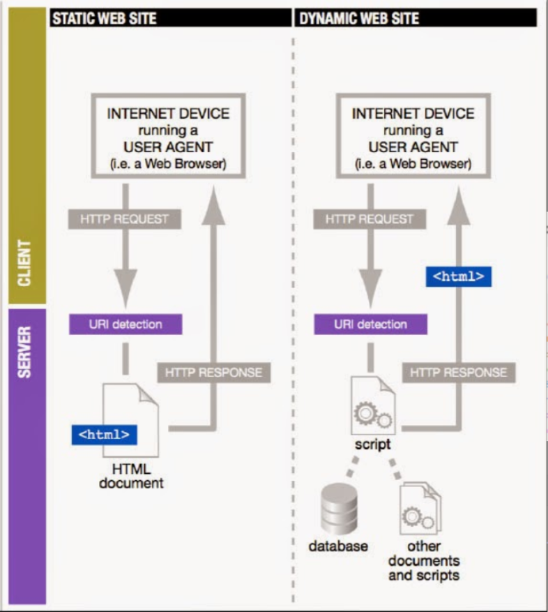

# IMCM - 3BHK
 
## Einleitung
 
### Markdown
 
*Markdown* ist eine auszeichnungssprache (*Markup Language*). Mit Auszeichnungssprachen werden Texte strukturiert. Einige Markup Languages sind z.b:
 
 - HTML (*Hypertext Markup Language*)
 - XML (*Extensible Markup Language*)
 - MD (*Markdown*)
 - YAML (*Yet another Markup Language*)
 
 Markdown ist heutzutage eine der beliebtesten Auszeichnungssprachen. Wenn eine README.md-Datei in einem Github-Repository vorhanden ist, wird sie automatisch auf der Hauptseite des Repositories angezeigt. Die README.md-Datei ist also die erste Anlaufstelle für Informationen über das Projekt.
 
 Um ein Github-Repository zu erstellen, sind folgende Schritte notwendig:
 
 - Im gewünschten Verzeichneis im Terminal (*bzw. Command Line Interface*)den Befehl `git init` ausführen.
 
>**Einschub zur Installation von Git:** Falls es bei der Eingabe von `git init` eine Fehlermeldung: *"Command not found"* erscheint, ist Git wahrscheinlich nicht installiert und der Befehl wird nicht erkannt. Bei der Installation wurd der Befehl der Umgebungsvariable `PATH` hinzugefügt. Darin sind die Bezeichnungen aller Programme enthalten, die vom Terminal aus aufgerufen werden können.
 
 - dann in GitHub-Desktop das lokale Repository hinzufügen. (*File > Add Local Repository*)
 - nun kann über die Schaltflächen **Commit to main** und **Push origin**   der aktuelle Veränderungen der Dateien ins Repository hochgeladen werden.
 
 
 
 ## Statische und Dynamische Websites
 
In den 1990er Jahren wurden Websites überwiegend statisch erstellt. Inhalte wurden als html-files auf einen Webserver hochgeladen. Bei jedem Aufruf der Website wurde der gleiche Inhalt angezeigt, unabhängig davon, wer die Seite besuchte. Solche Websites werden als statische Websites bezeichnet.
 
 

Die Abbildung zeigt, die Funktionsweise von statischen Websites. Zuerst muss der Domain-Name über das Domain Name System (DNS) in die IP-Adresse des Webservers aufgelöst werden (Schritt 1 und 2 in der Abbildung dargestellt).

Die Abbildung zeigt die Funktionsweise von statischen Websites. Zuerst muss der Domain-Name über das Domain Name System (DNS) in die IP-Adresse des Webservers aufgelöst werden (Schritt 1 und 2 in der Abbildung). Danach schickt der Client eine http-Anfrage an den entsprechenden Webserver und erhält von diesem eine http-Antwort, die überlicherweise zuerst die `index.html`enthält (Schritt 3 und 4).

Ab den 2000er Jahren setzten sich zunehmend dynamische Websites durch. Bei dynamischen Websites werden die Inhalte nicht mehr als fertige `html`-Files auf den Webserver hochgeladen, sondern in einer Datenbank gespeichert. Bei jedem Aufruf der Website werden die Inhalte aus der Datenbank abgerufen und in ein `html`-File eingebettet, das dann an den Browser des Nutzers übertragen wird. Die Inhalte können also je nach Nutzer unterschiedlich sein.

